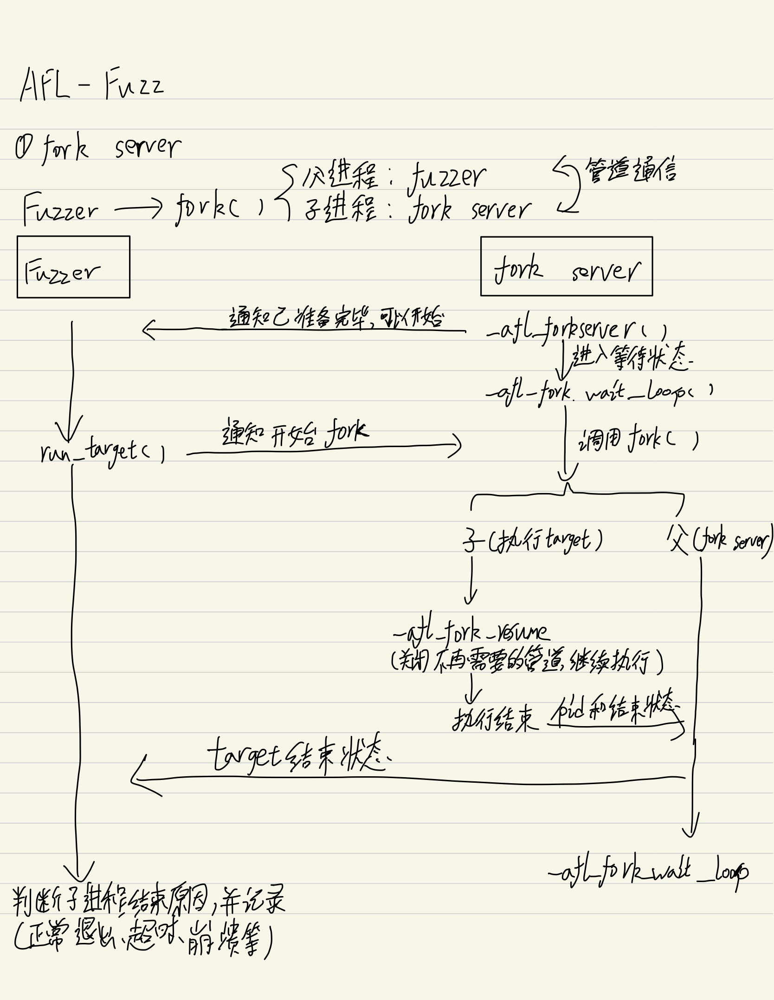

AFL算是非常有名的fuzzing工具了，最近开始系统的学习fuzz，在这里记录一下学习的一些笔记。

## afl-gcc

在使用afl进行fuzz之前，需要先使用afl-gcc/afl-clang等工具来编译目标，我们就先从afl-gcc开始这部分的内容。

代码位于afl-gcc.c：

```
/* Main entry point */

int main(int argc, char **argv) {

    if (isatty(2) && !getenv("AFL_QUIET")) {

        SAYF(cCYA "afl-cc " cBRI VERSION cRST " by <lcamtuf@google.com>\n");

    } else be_quiet = 1;

    if (argc < 2) {
        ...
        exit(1);
    }
    //查找fake GNU assembler
    find_as(argv[0]);
    // 设置CC的参数
    edit_params(argc, argv);
    // 调用execvp来执行CC

    // 这里我们在CC之前打印一下参数看看。
    for (int i = 0; i < sizeof(cc_params); i++) {
      printf("\targ%d: %s\n",i,cc_params[i]);
    }

    execvp(cc_params[0], (char **) cc_params);

    FATAL("Oops, failed to execute '%s' - check your PATH", cc_params[0]);

    return 0;

}
```
看过main就可以看出它本质上只是一个gcc的wrapper。
这里在execvp执行之前添加一段代码来打印参数就可以知道他具体的执行的内容：
```
for (int i = 0; i < sizeof(cc_params); i++) {
      printf("\targ%d: %s\n",i,cc_params[i]);
    }
```
结果如下：
```
$ ./afl-gcc ../test-instr.c -o test
afl-cc 2.57b by <lcamtuf@google.com>
        arg0: gcc
        arg1: ../test-instr.c
        arg2: -o
        arg3: test
        arg4: -B
        arg5: .
        arg6: -g
        arg7: -O3
```

有两个关键函数，这里就直接引用一下sakura师傅的笔记：

- find_as：

```
这个函数用来寻找afl-as的位置。
        它首先检查是否存在AFL_PATH这个环境变量，如果存在就赋值给afl_path，然后检查afl_path/as这个文件是否可以访问，如果可以访问，就将afl_path设置为as_path。
如果不存在AFL_PATH这个环境变量，则检查argv0，例如（”/Users/sakura/gitsource/AFL/cmake-build-debug/afl-gcc”）中是否存在’/‘，如果有就找到最后一个’/‘所在的位置，并取其前面的字符串作为dir，然后检查dir/afl-as这个文件是否可以访问，如果可以访问，就将dir设置为as_path
如果上述两种方式都失败，则抛出异常。
```

- edit_params

```
这个函数主要是将argv拷贝到u8 **cc_params中，并做必要的编辑。

    它首先通过ck_alloc来为cc_params分配内存，分配的长度为(argc+128)*8，相当大的内存了。
    
    然后检查argv[0]里有没有’/‘，如果没有就赋值’argv[0]’到name，如果有就找到最后一个’/‘所在的位置，然后跳过这个’/‘，将后面的字符串赋值给name。

将name和afl-clang比较
    如果相同，则设置clang_mode为1，然后设置环境变量CLANG_ENV_VAR为1。
然后将name和afl-clang++比较
    如果相同，则获取环境变量AFL_CXX的值，如果该值存在，则将cc_params[0]设置为该值，如果不存在，就设置为clang++
    如果不相同，则获取环境变量AFL_CC的值，如果该值存在，则将cc_params[0]设置为该值，如果不存在，就设置为clang

如果不相同，则将name和afl-g++比较
    如果相同，则获取环境变量AFL_CXX的值，如果该值存在，则将cc_params[0]设置为该值，如果不存在，就设置为g++
    如果不相同，则获取环境变量AFL_CC的值，如果该值存在，则将cc_params[0]设置为该值，如果不存在，就设置为gcc

然后遍历从argv[1]开始的argv参数
    跳过-B/integrated-as/-pipe
    如果存在-fsanitize=address或者-fsanitize=memory，就设置asan_set为1;
    如果存在FORTIFY_SOURCE，则设置fortify_set为1
    cc_params[cc_par_cnt++] = cur;

然后开始设置其他的cc_params参数
    取之前计算出来的as_path，然后设置-B as_path
    如果是clang_mode,则设置-no-integrated-as
    如果存在AFL_HARDEN环境变量，则设置-fstack-protector-all

sanitizer
    如果asan_set在上面被设置为1，则使AFL_USE_ASAN环境变量为1
    如果存在AFL_USE_ASAN环境变量，则设置-fsanitize=address
    如果存在AFL_USE_MSAN环境变量，则设置-fsanitize=memory，但不能同时还指定AFL_HARDEN或者AFL_USE_ASAN，因为这样运行时速度过慢。
    如果不存在AFL_DONT_OPTIMIZE环境变量，则设置-g -O3 -funroll-loops -D__AFL_COMPILER=1 -DFUZZING_BUILD_MODE_UNSAFE_FOR_PRODUCTION=1
    如果存在AFL_NO_BUILTIN环境变量，则设置-fno-builtin-strcmp等

最后cc_params[cc_par_cnt] = NULL;终止对cc_params的编辑
```

## afl-as

AFL的代码插桩，就是在将源文件编译为汇编代码后，通过afl-as完成的。

afl-as.c中插桩的大致逻辑是处理汇编代码，通过汇编的前导命令来判断这是否是一个分支或者函数，之后插入代码，并最终再调用as进行真正的汇编。

它是通过fprintf()将格式化字符串添加到汇编文件的相应位置

关键代码：
```
             ^func:      - function entry point (always instrumented)
             ^.L0:       - GCC branch label (GCC分支)
             ^.LBB0_0:   - clang branch label (but only in clang mode) (clang分支)
             ^\tjnz foo  - conditional branches (条件分支)

           ...but not:

             ^# BB#0:    - clang comments
             ^ # BB#0:   - ditto
             ^.Ltmp0:    - clang non-branch labels
             ^.LC0       - GCC non-branch labels
             ^.LBB0_0:   - ditto (when in GCC mode)
             ^\tjmp foo  - non-conditional jumps


while (fgets(line, MAX_LINE, inf)) {
    if(instr_ok && instrument_next && line[0] == '\t' && isalpha(line[1])){
        fprintf(outf, use_64bit ? trampoline_fmt_64 : trampoline_fmt_32,
                    R(MAP_SIZE));

        instrument_next = 0;
        ins_lines++;
    }
    ...
    if (line[0] == '\t' && line[1] == '.') {
        if (!strncmp(line + 2, "text\n", 5) ||
            !strncmp(line + 2, "section\t.text", 13) ||
            !strncmp(line + 2, "section\t__TEXT,__text", 21) ||
            !strncmp(line + 2, "section __TEXT,__text", 21)) {
            instr_ok = 1;
            continue;
        }

        if (!strncmp(line + 2, "section\t", 8) ||
            !strncmp(line + 2, "section ", 8) ||
            !strncmp(line + 2, "bss\n", 4) ||
            !strncmp(line + 2, "data\n", 5)) {
            instr_ok = 0;
            continue;
        }
    }
    ...
    if (line[0] == '\t') {
            if (line[1] == 'j' && line[2] != 'm' && R(100) < inst_ratio) {
                fprintf(outf, use_64bit ? trampoline_fmt_64 : trampoline_fmt_32,
                        R(MAP_SIZE));

                ins_lines++;
            }
            continue;

        }
    ...
    if (strstr(line, ":")) {
        if (line[0] == '.') {
            if ((isdigit(line[2]) || (clang_mode && !strncmp(line + 1, "LBB", 3)))
                        && R(100) < inst_ratio) {
                            instrument_next = 1;
                        }
        }
        else {
            /* Function label (always instrumented, deferred mode). */
            instrument_next = 1;
        }
    }
}
```
引用++
- 检查instr_ok && instrument_next && line[0] == '\t' && isalpha(line[1])即判断instrument_next和instr_ok是否都为1，以及line是否以\t开始，且line[1]是否是字母
    - 如果都满足，则设置instrument_next = 0,并向outf中写入trampoline_fmt，并将插桩计数器ins_lines加一。
    - 这其实是因为我们想要插入instrumentation trampoline到所有的标签，宏，注释之后。

- 首先要设置instr_ok的值，这个值其实是一个flag，只有这个值被设置为1，才代表我们在.text部分，否则就不在。于是如果instr_ok为1，就会在分支处执行插桩逻辑，否则就不插桩。
    - 如果line的值为\t.[text\n|section\t.text|section\t__TEXT,__text|section __TEXT,__text]...其中之一，则设置instr_ok为1，然后跳转到while循环首部，去读取下一行的数据到line数组里。
    - 如果不是上面的几种情况，且line的值为\t.[section\t|section |bss\n|data\n]...，则设置instr_ok为0，并跳转到while循环首部，去读取下一行的数据到line数组里。
- 插桩^\tjnz foo条件跳转指令
    - 如果line的值为\tj[!m]...,且R(100) < inst_ratio，R(100)会返回一个100以内的随机数，inst_ratio是我们之前设置的插桩密度，默认为100，如果设置了asan之类的就会默认设置成30左右。
    - fprintf(outf, use_64bit ? trampoline_fmt_64 : trampoline_fmt_32, R(MAP_SIZE));根据use_64bit来判断向outfd里写入trampoline_fmt_64还是trampoline_fmt_32。
        - define R(x) (random() % (x))，可以看到R(x)是创建的随机数除以x取余，所以可能产生碰撞
        - 这里的R(x)实际上是用来区分每个桩的，也就是是一个key。后文会再说明。
    - 将插桩计数器ins_lines加一。
- 首先检查该行中是否存在:，然后检查是否以.开始
    - 如果以.开始，则代表想要插桩\^.L0:或者\^.LBB0_0:这样的branch label，即style jump destination
        - 然后检查line[2]是否为数字 或者 如果是在clang_mode下，比较从line[1]开始的三个字节是否为LBB. 前述所得结果和R(100) < inst_ratio)相与。
            - 如果结果为真，则设置instrument_next = 1
    - 否则代表这是一个function，插桩^func:function entry point
        - 直接设置instrument_next = 1
- 如果插桩计数器ins_lines不为0，就在完全拷贝input_file之后，依据架构，像outf中写入main_payload_64或者main_payload_32，然后关闭这两个文件。

trampoline_fmt_32
```
  "\n"
  "/* --- AFL TRAMPOLINE (32-BIT) --- */\n"
  "\n"
  ".align 4\n"
  "\n"
  "leal -16(%%esp), %%esp\n"
  "movl %%edi, 0(%%esp)\n"
  "movl %%edx, 4(%%esp)\n"
  "movl %%ecx, 8(%%esp)\n"
  "movl %%eax, 12(%%esp)\n"
  "movl $0x%08x, %%ecx\n"
  "call __afl_maybe_log\n"
  "movl 12(%%esp), %%eax\n"
  "movl 8(%%esp), %%ecx\n"
  "movl 4(%%esp), %%edx\n"
  "movl 0(%%esp), %%edi\n"
  "leal 16(%%esp), %%esp\n"
  "\n"
  "/* --- END --- */\n"
  "\n";
```
该代码的作用是：
- 保存edi等寄存器
- 将ecx的值设置为fprintf()所要打印的变量内容
- 调用方法__afl_maybe_log()
- 恢复寄存器

__afl_maybe_log作为插桩代码所执行的实际内容

trampoline_fmt_64
```
"\n"
  "/* --- AFL TRAMPOLINE (64-BIT) --- */\n"
  "\n"
  ".align 4\n"
  "\n"
  "leaq -(128+24)(%%rsp), %%rsp\n"
  "movq %%rdx,  0(%%rsp)\n"
  "movq %%rcx,  8(%%rsp)\n"
  "movq %%rax, 16(%%rsp)\n"
  "movq $0x%08x, %%rcx\n"
  "call __afl_maybe_log\n"
  "movq 16(%%rsp), %%rax\n"
  "movq  8(%%rsp), %%rcx\n"
  "movq  0(%%rsp), %%rdx\n"
  "leaq (128+24)(%%rsp), %%rsp\n"
  "\n"
  "/* --- END --- */\n"
  "\n";
```
64和32差别不是很大，就不单独赘述了。

##### main函数
- 读取环境变量AFL_INST_RATIO的值，设置为inst_ratio_str
设置srandom的随机种子为rand_seed = tv.tv_sec ^ tv.tv_usec ^ getpid();
设置环境变量AS_LOOP_ENV_VAR的值为1
读取环境变量AFL_USE_ASAN和AFL_USE_MSAN的值，如果其中有一个为1，则设置sanitizer为1，且将inst_ratio除3。
    - 这是因为AFL无法在插桩的时候识别出ASAN specific branches，所以会插入很多无意义的桩，为了降低这种概率，粗暴的将整个插桩的概率都除以3

- edit_params(argc, argv)
- add_instrumentation()
- fork出一个子进程，让子进程来执行execvp(as_params[0], (char **) as_params);
    - 这其实是因为我们的execvp执行的时候，会用as_params[0]来完全替换掉当前进程空间中的程序，如果不通过子进程来执行实际的as，那么后续就无法在执行完实际的as之后，还能unlink掉modified_file
    - exec系列函数 https://www.cnblogs.com/mickole/p/3187409.html
    - fork出的子进程和父进程 https://blog.csdn.net/THEONE10211024/article/details/13774669
- waitpid(pid, &status, 0)等待子进程结束
- 读取环境变量AFL_KEEP_ASSEMBLY的值，如果没有设置这个环境变量，就unlink掉modified_file。


### afl-fuzz




https://www.anquanke.com/post/id/213431#h2-2

https://rk700.github.io/2017/12/28/afl-internals/

http://rk700.github.io/2018/01/04/afl-mutations/